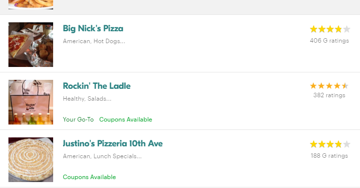

# Seamless-Google-Reviews
This Chrome Extension replaces Seamless Reviews with Google Ratings from the Places API.

## Example Screenshot

The extension will replace the star ratings section if it exists in the Places API. If it doesn't exist, we'll keep Seamless' ratings for now cause some ratings are better than no ratings! Rockin' the Ladle didn't exist in Google Places API, so we left regular Seamless stars on that one.

## How to Use
Install this via chrome extensions, link to come soon.

If you're a developer looking to play around with this, clone this repo to a directory on your computer, then load unpacked extention in Chrome! Going to any Seamless page and refreshing should trigger the script, as well as any subsequent calls.

## Why?
One of the restaurants with low reviews actually had great food. Their score was high on Google Maps but low on Seamless cause of delivery hits (it did take a while to get here after all)

## To-do List (forgot to add this earlier, notepad was basically Trello)
- ~~Investigation: Research how manifests, content scripts, and background scripts work.~~
- ~~Use a content script to fetch the restaurant names.~~
- ~~Pass the names from the content script to the background script.~~
- ~~Make API request to Google Places API from background script.~~
- ~~Massage the data into something legible.~~
- ~~Return it to the content script.~~
- ~~Add CSS.~~
- ~~Replace nodes on seamlesss with generated nodes.~~
- ~~Make the extension run on asynchronous requests instead of just on page load, new searches should kick off ratings requests~~
- Minimize the number of requests to save money on Google Places API.
- Add a popup to disable or enable the app.
- Memorize the restaurants and store their ratings in storage.
- Extend this functionality to other site (doordash, caviar, uber eats)...
