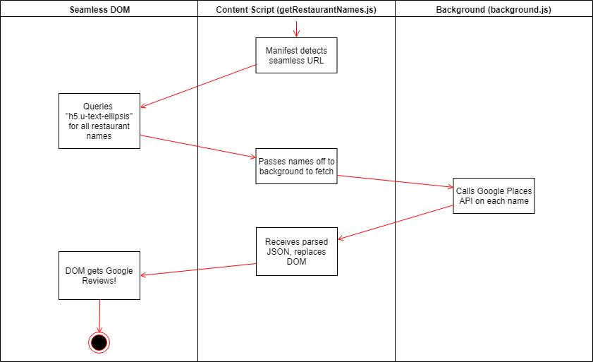

# Seamless-Google-Reviews
This Chrome Extension replaces Seamless Reviews with Google Ratings from the Places API.

## Example Screenshot

The extension will replace the star ratings section if it exists in the Places API. If it doesn't exist, we'll keep Seamless' ratings for now cause some ratings are better than no ratings! Rockin' the Ladle didn't exist in Google Places API, so we left regular Seamless stars on that one.

## How to Use
Install this via chrome extensions, link to come soon.

If you're a developer looking to play around with this, clone this repo to a directory on your computer, then load unpacked extention in Chrome! Going to any Seamless page and refreshing should trigger the script.

## How does it work under the hood?

### Data Flow
Here's a visual of how the chrome extension works.

### Written Steps
1. Manifest specifies content script getRestaurantNames.js to run on Seamless search pages.
2. getRestaurantNames.js waits until the element of interest loads.
3. Content script fetches all the restaurant names.
4. Names get passed to background script background.js via a message.
5. background.js has an onMessage handler, makes several requests to Google Places API.
6. Once all of them resolve, we send a response back to the content script.
7. Replace all Seamless Review with HTML defined in createGoogleRating of the content script.
8. Styles for these ratings are supported in googleReviews.css.

## Why?
One of the restaurants with low reviews actually had great food. Their score was high on Google Maps but low on Seamless cause of delivery hits (it did take a while to get here after all)
